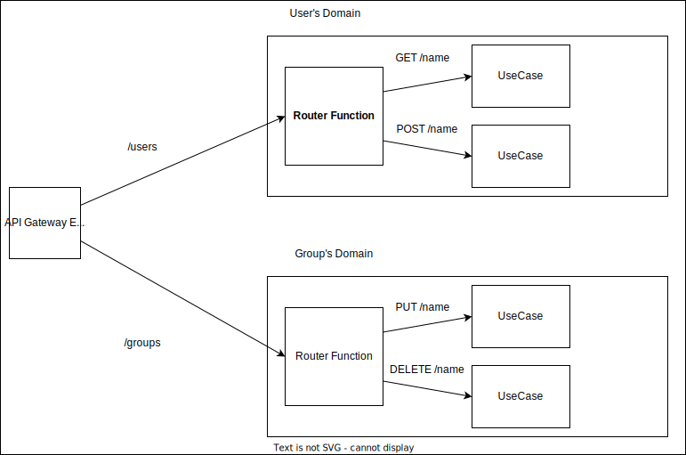

# Nishiki Backend


This is Nishiki's backend. The entry point is handler.ts under the src directory.

## Directory Structure

The actual code is located in the /src directory. The /test folder has test files.
The /other directory is for developing.

## Environment

This project uses docker compose to create the test environment.
If you don't install it on your machine yet, install [it](https://www.docker.com/get-started/).
The commands explained on this page should be run on the bash of the docker container.

To enter inside the container, run the following command.

```shell
$ docker compose run app bash
```

When the package is changed or you try to run the first time, you have to install packages.

```shell
$ npm ci
```

## Test

This project uses [vitest](https://vitest.dev/) to run tests and which configuration file is vitest.config.ts. 

```shell
$ npm run test
```

## API Documentation

If you need to check the API document, you run the following command and the API document will be generated on the */docs* directory.
It is generated by [typedoc](https://typedoc.org/). The config file is *typedoc.json*.
This project uses a [type theme hierarchy](https://github.com/DiFuks/typedoc-theme-hierarchy).

```shell
$ npm run typedoc
```

If you want to use [watch mode](https://typedoc.org/options/other/#watch), run following command:

```shell
$ npm run typedoc:watch
```

## Structure of Application

This application is influenced by Clean Architecture and Domain Driven Development.
Therefore, sometimes that jargon is used inside the code.

Fundamentally, this application is divided into; Controller, Repository, Domain, and UseCase.
The main logic is encapsulated in the Domain and UseCase.
Other parts are used to interact with outside of this application.

Inside this application, the application is divided by domain.
Each domain has the above functions.(Controller, Repository and, so on...)

### HTTP Request Handling from API Gateway

This application is connected to the API Gateway.
Thus, this application needs to act as the REST API.
Those behavior are defined in the `Router`s.
Once the Router gets a request from a client, the router calls the appropriate controller.



### Error Handling

Most of the errors that occur in this application are handled explicitly using [result-type](https://github.com/hitohata/result-ts-type) without try-catch syntax.
But trying to handle every error the same way causes an increase in the cost of implementation without few benefits.
Therefore, this application admits to throwing errors inside the external communication process.
Because those errors are out of control in this application.
That would be the repository and controller layer only.

The repository layer is called inside the use case that is called by the controller.
To catch this error, in the controller wraps calling logic by the try-catch.
By doing so, every thrown error can be caught in the controller layer, and we can aggregate all that kind of logic into one place. 

```ts

class Controller {

    // this is the actual use case caller.
    // this is overwritten when creating the concrete class. 
    protected abstruct handler() {}
    
    // this method is called by other functions like the router.
    public execute() {
        try {
            return this.handler() // call handler method. 
        } catch (err) {
            // write handling error logics.
        }
    }

}

```

The concrete class is defined [here](./src/Shared/Layers/Controller/Controller.ts)